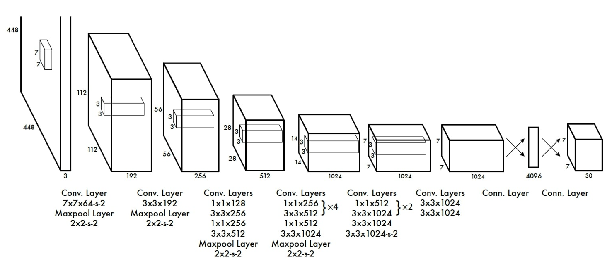

# YOLO-V1

The main goal of this project is YOLO-v1 implementation for object detection tasks. I used PASCAL Visual Object Classes dataset (VOC 2007) and trained my model on it. 

here is the architecture of YOLO-v1:

 

